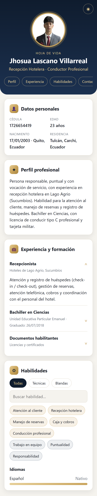
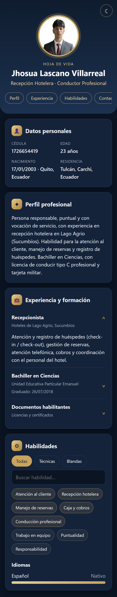
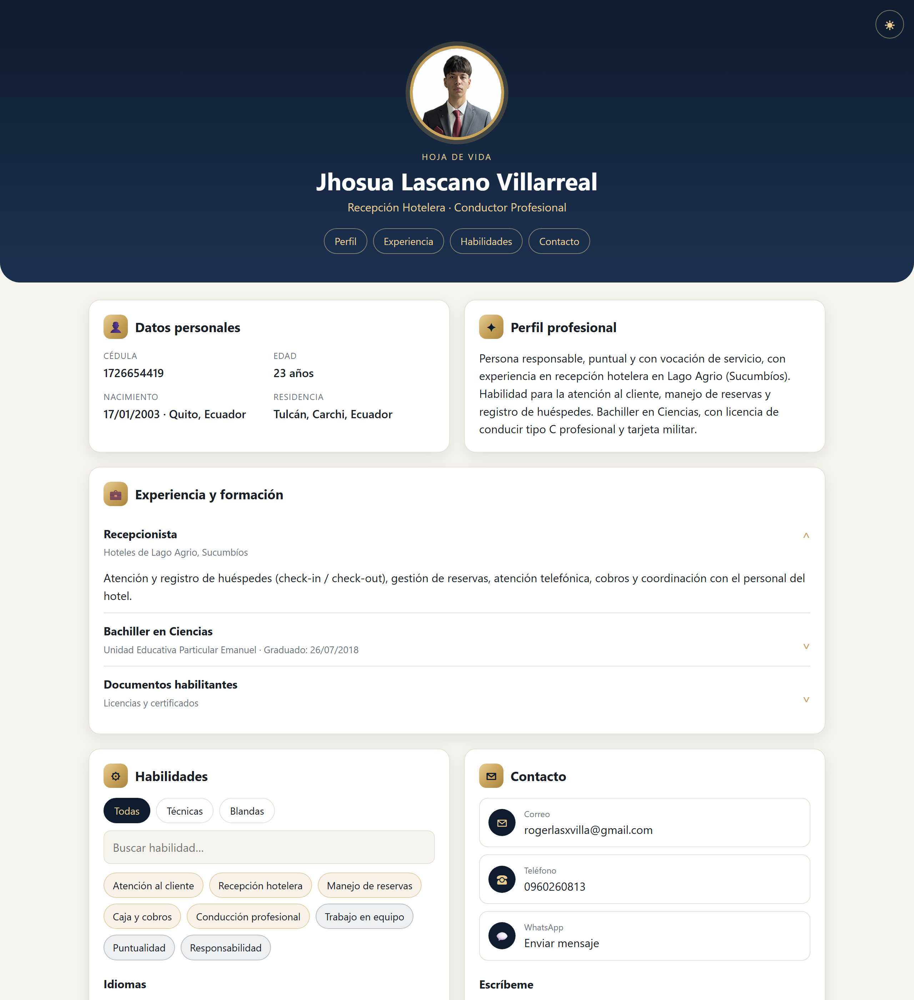
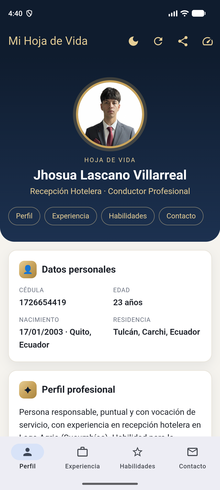
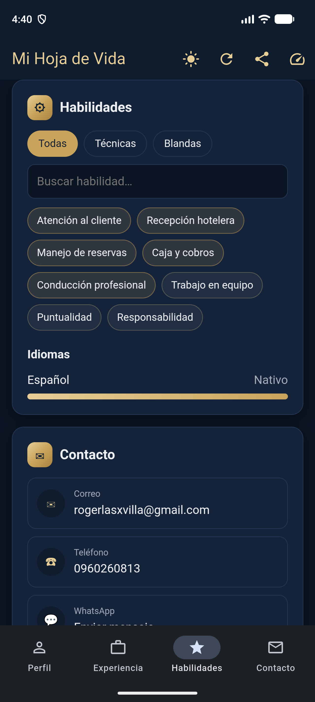
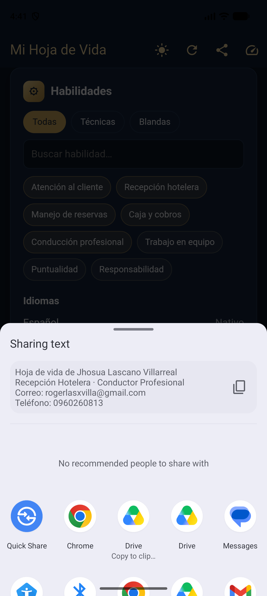

# Hoja de Vida: de app nativa a web responsiva embebida en Flutter

**Autor:** Jhosua Lascano Villarreal

Esta práctica parte de la hoja de vida interactiva que hice antes como app **nativa Android** (Kotlin + Jetpack Compose).
Ahora la convierto en una **web responsiva Mobile-First** (HTML5 + CSS3 + JavaScript) y la meto dentro de una
**app Flutter** (`cv_flutter_wrapper`) usando un **WebView**, que es lo que se llama un contenedor híbrido.

## Estructura del repositorio

```
HojaDeVidaApp/
├── web/                      ← FASE 1: hoja de vida web (código fuente único)
│   ├── index.html            HTML5 semántico: header, section, article, footer
│   ├── css/styles.css        Mobile-First, Flexbox + Grid, tema claro/oscuro
│   ├── js/app.js             Desplegables, filtro de habilidades, validación, API para Flutter
│   └── img/foto.jpg
├── cv_flutter_wrapper/       ← FASE 2: contenedor Flutter
│   ├── pubspec.yaml          webview_flutter, url_launcher, share_plus + assets
│   ├── lib/main.dart         AppBar y NavigationBar nativas + WebView
│   ├── assets/web/           Copia de /web (Opción A: offline)
│   ├── android/app/src/main/AndroidManifest.xml
│   └── test/widget_test.dart
├── app/                      Proyecto original nativo (Android Studio / Kotlin)
├── docs/
│   ├── capturas/             Capturas para el informe
│   └── ANDROID_NATIVO.md     Instrucciones de la práctica anterior
└── sync_web.sh               Copia /web → cv_flutter_wrapper/assets/web
```

---

## Fase 1: rediseño a formato web

| Requisito | Cómo se cumple |
|---|---|
| HTML5 semántico | `<header>` (foto, nombre, navegación), `<main>` con `<section>` por bloque, `<article>` para cada experiencia o estudio, `<footer>` |
| Secciones clave | Datos personales, Perfil profesional, Experiencia y formación, Habilidades (con idiomas) y Contacto |
| Mobile-First | Los estilos base son para el celular (1 columna). Con `@media (min-width: 640px)` y `(min-width: 960px)` se pasa a un **Grid** de 2 columnas |
| Flexbox / Grid | Flexbox en navegación, chips y filas de contacto. Grid en el contenedor, los datos personales y los desplegables animados |
| Interactividad JS | 1) **Desplegables** con animación en experiencia y formación · 2) **Filtrado de habilidades** por tipo (técnicas o blandas) y búsqueda sin tildes · 3) **Validación del formulario** de contacto con mensajes por campo, que luego abre el correo · 4) Tema claro/oscuro guardado en `localStorage` · 5) Animación de aparición al hacer scroll · 6) Edad calculada desde la fecha de nacimiento |
| Accesibilidad | `aria-expanded`, `aria-live` en los errores, `label` en cada campo, respeta `prefers-reduced-motion` |

Uso los mismos colores de la app nativa (`Theme.kt`): Navy `#0F1C2E` y Gold `#C9A45C`.

**Para probarla en el navegador:**

```bash
python -m http.server 5500 --directory web
```

Luego abre http://localhost:5500. Para ver la vista móvil, usa F12 → *Toggle device toolbar*.

| Móvil (claro) | Móvil (oscuro) | Escritorio |
|---|---|---|
|  |  |  |

---

## Fase 2: integración en Flutter

### Enfoque elegido: **Opción A, archivos locales (assets)**

Elegí esta opción porque es la menos compleja: no hay que desplegar nada en un servidor, la app funciona **sin internet**
y la carga es inmediata. La web se declara en el `pubspec.yaml` y se abre con `loadFlutterAsset('assets/web/index.html')`.

### Controles nativos de la app

| Control nativo | Qué hace |
|---|---|
| ☀/☾ en la **AppBar** | Cambia entre tema claro y oscuro de toda la app. Flutter llama a `cvApp.setTheme()` dentro de la web para que también cambie, y oculta el botón de tema propio de la web con `cvApp.setEmbedded(true)` |
| ⟳ **Recargar** | `WebViewController.reload()` y una barra de progreso dorada |
| ↗ **Compartir perfil** | Abre la hoja de compartir nativa (`share_plus`) |
| ⏱ **Rendimiento** | Muestra cuántos ms tardó la web en cargar dentro del WebView |
| **NavigationBar** inferior | Perfil / Experiencia / Habilidades / Contacto: hace scroll a esa sección con `cvApp.scrollTo()` |
| Enlaces de contacto | `NavigationDelegate` detecta `mailto:`, `tel:` y `https://wa.me` y los abre con la app nativa (`url_launcher`) |

**Comunicación entre Flutter y la web:** el archivo `web/js/app.js` expone `window.cvApp` y Flutter lo usa con `runJavaScript(...)`.

### Cómo ejecutarla

Requisito: tener instalado el Flutter SDK (`flutter doctor` sin errores) y un emulador o un celular conectado.

```bash
cd cv_flutter_wrapper
flutter create . --project-name cv_flutter_wrapper --platforms android,ios
flutter pub get
flutter run
```

> `flutter create .` solo genera las carpetas de plataforma que faltan (Gradle, iOS, íconos).
> **No sobrescribe** `lib/main.dart`, `pubspec.yaml`, `test/` ni el `AndroidManifest.xml` que ya están en el proyecto.

Para generar el APK: `flutter build apk --release` (el archivo queda en `build/app/outputs/flutter-apk/app-release.apk`).

Si cambias algo de la web, cópiala de nuevo a los assets con `bash sync_web.sh`.

### Capturas de la app Flutter

Capturas tomadas en el emulador (Android 17, API 37):

| Tema claro | Tema oscuro | Compartir nativo |
|---|---|---|
|  |  |  |

---

## Evaluación comparativa: nativo puro vs. contenedor híbrido

| Criterio | Android nativo (Kotlin + Compose) | Flutter + WebView (híbrido) |
|---|---|---|
| **Plataformas con un solo código** | Solo Android | Android, iOS y además la misma web en cualquier navegador |
| **Lenguajes** | Kotlin | HTML/CSS/JS para el contenido y Dart para el contenedor |
| **Líneas de código de la UI** | ~920 (6 archivos `.kt`) | ~640 de web + ~210 de Dart |
| **Tamaño del APK** | 9,1 MB (`output/HojaDeVida.apk`) | **15,3 MB** por arquitectura (arm64, `--split-per-abi`) · 43,6 MB el APK universal con 3 arquitecturas. Incluye el motor de Flutter |
| **Arranque y primera pantalla** | Más rápido: Compose dibuja directamente | Un poco más lento: arranca el motor Flutter y luego el WebView carga el HTML (se mide con el botón ⏱) |
| **Fluidez de scroll y animaciones** | 60 fps nativos y animaciones de Compose | Buena con CSS (transform/opacity), pero depende del motor WebView de Android y puede sentirse menos “nativo” |
| **Memoria RAM** | Menor | Mayor, porque corren Flutter y el proceso de Chromium del WebView |
| **Acceso a funciones del dispositivo** | Directo (Intents, visor PDF propio) | A través de un puente: Flutter abre correo, teléfono y compartir por la web |
| **Funciona sin internet** | Sí | Sí (Opción A, assets) |
| **Actualizar el contenido** | Recompilar y reinstalar el APK | Editar la web. Con la Opción B (URL remota) se actualiza sin publicar una app nueva |
| **Aspecto y experiencia** | Material 3 coherente con Android | La AppBar y la navegación son nativas, pero el contenido se ve como “web” (selección de texto, rebote, etc.) |
| **Depuración** | Android Studio Layout Inspector | DevTools del navegador para la web y Flutter DevTools para el contenedor |
| **Curva de aprendizaje** | Se necesita saber Kotlin y Compose | La web es conocimiento muy común y el contenedor Flutter es pequeño |

### Conclusión

- El **nativo puro** da la mejor **experiencia y rendimiento**: arranca más rápido, usa menos memoria, el APK es más ligero
  y las animaciones y la integración con el sistema son totalmente nativas.
- El **contenedor híbrido** gana en **reutilización y mantenimiento**: el mismo HTML/CSS/JS funciona como página web,
  en Android y en iOS. Flutter solo añade una capa delgada de controles nativos (tema, recargar, compartir, navegación).
  A cambio, la app pesa más, consume más memoria y el contenido no se siente 100 % nativo.
- Para un producto con **mucho contenido y poca lógica**, como una hoja de vida, el enfoque híbrido es muy conveniente.
  Para apps con **mucha interacción, animaciones complejas o uso intensivo del hardware**, conviene el desarrollo nativo
  o la UI construida directamente con widgets de Flutter.
